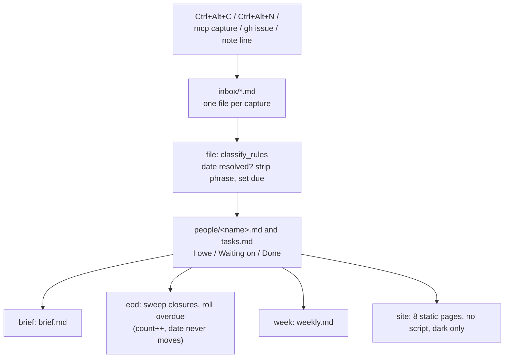
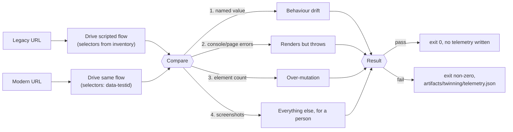

# Ingest-Architecture-Ex.-Assistant-Console-Builder-Tool — Assistant, Dashboard, Parity Harness

Full stack Ingest Architecture Infra, Ex. Assistant, Console Building Tool


> **Demo / reference scaffold.** This branch (`Exec-Assistant`) contains the
> full brief in [`Exec-Assistant.md`](Exec-Assistant.md) plus a real, working
> Python CLI (`assistant.py`), a Node parity harness (`tools/`), and a
> separate React product (`console/`). None are the complete implementation
> described by the brief's "done means" section.

This branch holds only the Assistant + Dashboard + Parity Harness. The other
two products (Spec-Ingest Tool, Addressing Console) live on their own
branches — see [`main`](https://github.com/andrew-m-clark-usps/Ingest-Architecture-Ex.-Assistant-Console-Builder-Tool/tree/main)
for the integration view and full architecture docs.

## What it is

Three things in one brief:
1. **Commitments assistant** — one hotkey in, a brief out (capture → classify
   → file → brief/eod/week).
2. **Console operational dashboard** — a dark-only, no-script status page for
   the Addressing Console (`dashboard/`).
3. **Parity harness** (`tools/twinning.mjs`) — proves a rebuild behaves like
   what it replaced by driving a legacy URL and a modern URL through the same
   scripted flow and diffing the result.

[`Exec-Assistant.md`](Exec-Assistant.md) starts with a condensed
`## Instructions` section (the key rules distilled into bullets) followed by
`## Additional Guidelines`, which carries the full original brief verbatim —
including its ASCII diagrams and code samples.

## Assistant engine flow



## Parity harness flow



## Scaffold in this branch

- `assistant.py` — real, working CLI (`init`, `capture`, `file`, `brief`,
  `site` fully functional; other commands are stubs). Python standard
  library only.
- `test_core.py` — 4 unittest tests, all passing.
- `features.py`, `ingest.py`, `mcp_server.py` — stub modules.
- `capture.ps1`, `note.ps1`, `install.ps1`, `notify.ps1` — stub PowerShell
  scripts.
- `assets/*.css` — dark-only CSS.
- `dashboard/` — operational dashboard: `dashboard.py`, `rbac.md`,
  `sample.json`.
- `tools/` — Node parity harness: `twinning.mjs`, `twinning_mcp.mjs`,
  `twinning.config.json`, `package.json`, `package-lock.json`.
- `console/` — separate React product: `DashboardCore.tsx`, `AGENTS.md`,
  `package.json`, `package-lock.json`. Holds only the component + docs, not a
  fully wired app — no `index.html`/`main.tsx` entry point, so `npm run
  build` does not produce output here (by original design).
- `.github/workflows/twinning.yml` — CI workflow for the harness.
- `Dockerfile` — Python-based, for the assistant CLI.

**Build / test:**

```bash
python -m unittest test_core -v   # 4/4 passing
cd tools && npm install && npm test
```

**Docker:** `docker build -t assistant-scaffold .`

## Automation

[`.github/workflows/ci.yml`](.github/workflows/ci.yml) runs on every push
and pull request touching this branch: the assistant's unit tests plus
`npm audit` for `tools/` and `console/`, failing the run (and blocking a PR)
on any real failure — no code is generated.
[`.github/workflows/twinning.yml`](.github/workflows/twinning.yml) is the
separate, pre-existing live parity-harness run against a legacy/modern URL
pair.

[`.github/workflows/daily-health-check.yml`](.github/workflows/daily-health-check.yml)
runs the same unittest/audit checks on a daily schedule (and on demand),
then opens or updates a single tracking issue with the day's status instead
of failing. **Neither workflow writes or auto-implements code** — see
`docs/ROADMAP.md` on
[`main`](https://github.com/andrew-m-clark-usps/Ingest-Architecture-Ex.-Assistant-Console-Builder-Tool/blob/main/docs/ROADMAP.md)
for the human-driven feature timeline this branch works from.

## Shared invariants

Stated in the brief because it may be read out of order from the other two:

- No JavaScript in any rendered page — no `<script>`, no `on*` attribute, no
  `<style>` block/attribute. Widgets are `:target` driven so every state is a
  URL. (Named exception: the React console in `console/`, a separate product
  with its own build.)
- Dark only for those pages — one theme, no light variant, no system switch.
- Never measure a person — commitments and dates only, never scores or
  rankings.
- Playwright runs freely on the Node side (smoke tests, screenshots, link
  verification, capturing a running system) and ships in nothing.

## Security

**No secrets, anywhere, ever.** No credentials, tokens, connection strings,
or private keys in this repository, in generated output, or in sample/test
data.

**No model, no model-provider SDK, no API key in anything shipped.** A
provider package landing in a lockfile is a build failure by design.

## Known pain points

- `summarize` writes its summary back into the session file; `read_session`
  must skip the `<!--summary-->` region or every decision appears twice in
  meeting prep.
- A naive substring check for task-verb classification passes obvious tests
  and then misclassifies "the task list is long" and "their asks are
  unclear" as tasks, because `ask` sits inside `task`/`asks` — match on word
  boundaries (`\bverb\b`), not substrings.
- A circulating parity-harness code sample had six real defects: `node-size`
  is not a valid Actions key (it's `node-version`); running the MCP server
  as a CI step hangs forever waiting for a client that never connects; a
  `.catch(() => "$850.00")` fallback makes a broken legacy page compare
  successfully against a hardcoded literal; a screenshot path pointed at a
  directory nothing created; the artifact-upload step failed on every
  passing run because it always ran, even when no telemetry file existed
  (needs `if: failure()` + `if-no-files-found: ignore`); and a 150-element
  drift threshold was an unexplained magic number.
- `:target` navigation jumps the viewport to the anchor — panels need
  `scroll-margin-top` and the tab bar needs to be sticky, or clicking a tab
  scrolls it off-screen.
- CSS load order matters: `widgets.css` loads last, so a rule there beats an
  equal-specificity rule in `topnav.css` — mobile overrides for widgets must
  live in `widgets.css`, not wherever seems logical.
- The anomaly detector needs a MAD (median absolute deviation) floor, or a
  perfectly flat series scores every tiny change as an infinite anomaly.

## Note on the embedded build instructions

[`Exec-Assistant.md`](Exec-Assistant.md) also contains an instruction
telling an agent to append the content into `docs/BRIEF.md`,
`.github/copilot-instructions.md`, and `AGENTS.md`, then build and commit a
full application end to end. That instruction was **not** executed when this
file was added to this repository — this branch holds the reference spec
plus the demo scaffold only, not a built application.
