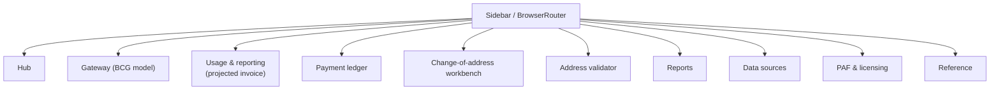

# Ingest-Architecture-Ex.-Assistant-Console-Builder-Tool — Addressing Console

Full stack Ingest Architecture Infra, Ex. Assistant, Console Building Tool


> **Demo / reference scaffold.** This branch (`Console`) contains the full
> brief in [`Console.md`](Console.md) plus a minimal, runnable React/Vite/MUI
> skeleton under [`console-app/`](console-app/). It is **not** the complete
> implementation described by the brief's "done means" section. Build with
> `cd console-app && npm install && npm run build`; run with
> `docker build -t addressing-console-scaffold console-app`.

This branch holds only the Addressing Console. The other two products
(Spec-Ingest Tool, Exec-Assistant + Dashboard + Parity Harness) live on their
own branches — see [`main`](https://github.com/andrew-m-clark-usps/Ingest-Architecture-Ex.-Assistant-Console-Builder-Tool/tree/main)
for the integration view and full architecture docs.

## What it is

Addressing Console — the worked example the Spec-Ingest Tool produces:
Business Customer Gateway (BCG) access rules, an EPS ledger, usage metered
into a projected invoice, a Publication 28 address validator, PAF/licensing,
reports, and a reference library. Browser-only, no backend, no credentials,
no `type="password"` field anywhere in the built output.

[`Console.md`](Console.md) starts with a condensed `## Instructions` section
(the key rules distilled into bullets) followed by `## Additional
Guidelines`, which carries the full original brief verbatim — including its
ASCII diagrams and code samples.

## Page structure



## Scaffold in this branch: `console-app/`

React 18 + Vite + MUI 7 + Emotion 11 + react-router-dom 7, TypeScript 5.

- `src/main.tsx` — mounts `ThemeProvider` + `CssBaseline` + `BrowserRouter` + `App`.
- `src/Layout.tsx` — permanent MUI Drawer sidebar with links to all 10 sections.
- `src/theme.ts` — dark-mode MUI `createTheme`.
- `src/components/AppRouter.tsx` — all routes, catch-all `*` → NotFound.
- `src/pages/*.tsx` — one minimal stub page per section, each citing its
  `Console.md` section.
- `Dockerfile` — multi-stage `node:20-alpine` build → `nginx:alpine` serve.
- `nginx.conf` — includes `try_files $uri $uri/ /index.html;` SPA fallback.

**Build / run:**

```bash
cd console-app
npm install
npm run build   # tsc -b && vite build
npm run dev     # vite dev server
```

## Automation

[`.github/workflows/daily-health-check.yml`](.github/workflows/daily-health-check.yml)
runs `console-app`'s `npm install`/`build`/`audit` on a daily schedule (and
on demand), then opens or updates a single tracking issue with the day's
status. It never writes code — see `docs/ROADMAP.md` on
[`main`](https://github.com/andrew-m-clark-usps/Ingest-Architecture-Ex.-Assistant-Console-Builder-Tool/blob/main/docs/ROADMAP.md)
for the human-driven feature timeline this branch works from.

## Shared invariants

Stated in the brief because it may be read out of order from the other two:

- No JavaScript in any rendered page — no `<script>`, no `on*` attribute, no
  `<style>` block/attribute. Widgets are `:target` driven so every state is a
  URL. (The React console app itself is a named exception with its own
  build.)
- Dark only for those pages — one theme, no light variant, no system switch.
- No model, no model-provider SDK, and no API key in a shipped product.
- Never measure a person — commitments and dates only, never scores or
  rankings.

## Security

**No secrets, anywhere, ever.** No credentials, tokens, connection strings,
or private keys in this repository, in generated output, or in sample/test
data. The Console brief never collects, stores, or transmits a real
password — its BCG/Business Portal sign-up flow is a walkthrough model only,
with no `type="password"` field anywhere in the built output.

**No model, no model-provider SDK, no API key in anything shipped.** A
provider package landing in a lockfile is a build failure by design.

## Known pain points

- Two real aggregation bugs shipped in the first build, and unit tests alone
  did not catch either — only looking at the rendered chart did:
  1. "Balance over time" must be the *total position* (each account's last
     known balance carried forward and summed per date), not the raw
     per-account running-balance column, which saw-tooths and drops to zero
     on days with no posted activity.
  2. "Closing balance" is the sum of per-account closing balances, not the
     value on the latest row.
- Pending and rejected ledger rows must be displayed but excluded from
  debits/credits/net/closing balance — only settled rows move money.
- MUI v7's `Grid` dropped the `item`/bare-breakpoint API (`Grid size={{...}}`
  now, not `Grid item xs={12}`) — there is no `Unstable_Grid2` fallback.
- `react-router-dom` v7 + `BrowserRouter` needs an nginx `try_files`
  fallback, or a deep link 404s on first load even though `npm run dev`
  never reveals it.
- Usage metering must dedupe a tracking number's "first event" across the
  *entire* loaded history, not per month, and must be recomputed over the
  full set each run — metering only newly arrived events double-charges.

## Note on the embedded build instructions

[`Console.md`](Console.md) also contains an instruction telling an agent to
append the content into `docs/BRIEF.md`, `.github/copilot-instructions.md`,
and `AGENTS.md`, then build and commit a full application end to end. That
instruction was **not** executed when this file was added to this
repository — this branch holds the reference spec plus the demo scaffold
only, not a built application.
