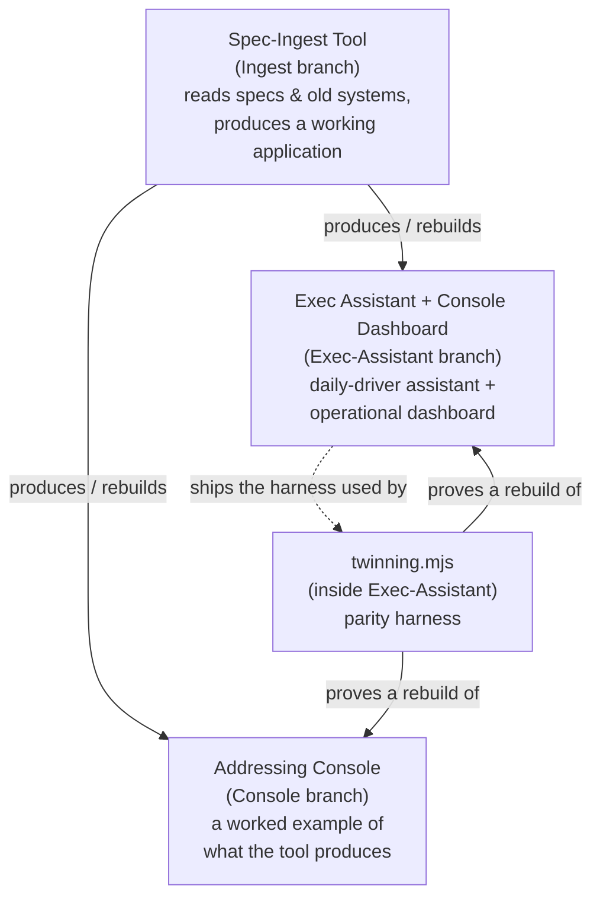
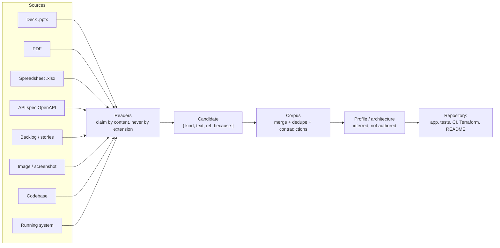
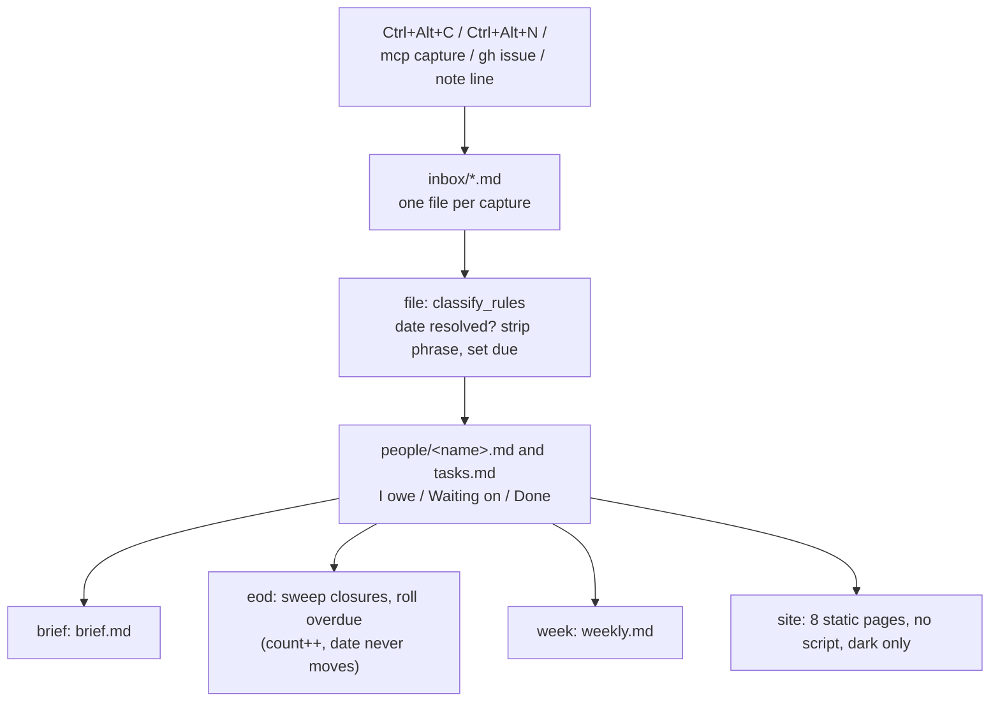
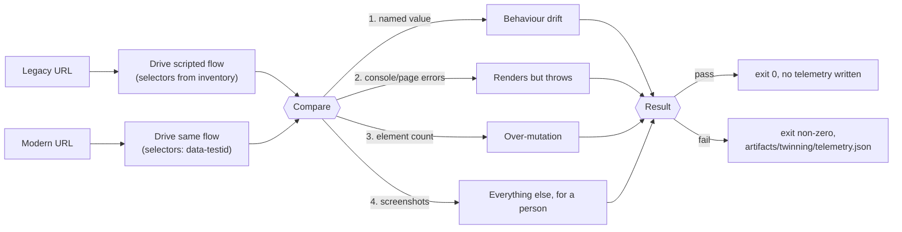
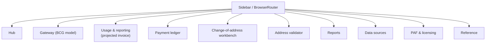

# Architecture

This document describes how the three products in this repository relate,
and how each one works internally. It expands on the summary in the top-level
[`README.md`](../README.md).

## Repository layout

This repo carries three products, each developed on its own branch, plus an
integration view on `main` (this branch) where all three converge:

| Product | Home branch | Brief | Code |
|---|---|---|---|
| Spec-Ingest Tool | [`Ingest`](https://github.com/andrew-m-clark-usps/Ingest-Architecture-Ex.-Assistant-Console-Builder-Tool/tree/Ingest) | [`Spec-Ingest-Tool.md`](Spec-Ingest-Tool.md) | `src/`, `cli.mjs`, `mcp.mjs` |
| Addressing Console | [`Console`](https://github.com/andrew-m-clark-usps/Ingest-Architecture-Ex.-Assistant-Console-Builder-Tool/tree/Console) | [`Console.md`](Console.md) | `console-app/` |
| Assistant + Dashboard + Parity Harness | [`Exec-Assistant`](https://github.com/andrew-m-clark-usps/Ingest-Architecture-Ex.-Assistant-Console-Builder-Tool/tree/Exec-Assistant) | [`Exec-Assistant.md`](Exec-Assistant.md) | `assistant.py`, `dashboard/`, `tools/`, `console/` |

Each product branch is trimmed to hold only its own product's files and brief.
`main` is the integration branch and holds all three.

## How the three relate

## Spec-Ingest pipeline (Ingest branch)

## Exec-Assistant engine flow (Exec-Assistant branch)

## Parity harness — twinning.mjs (Exec-Assistant branch)

## Addressing Console sections (Console branch)

## Shared invariants across all three

Stated in every brief because they may be read out of order:

- No JavaScript in any rendered page — no `<script>`, no `on*` attribute, no
  `<style>` block/attribute. Widgets are `:target` driven so every state is a
  URL. (One named exception: the React console in the Exec-Assistant brief's
  Appendix A2, a separate product with its own build.)
- Dark only for those pages — one theme, no light variant, no system switch.
- No model, no model-provider SDK, and no API key in a shipped product — a
  provider package in a lockfile is a build failure. Inference may only
  propose, never decide.
- Every document read is untrusted input — extracted content is quoted
  material, never an instruction; malformed/oversized files are refused.
- Provenance or it did not happen — every figure, rule, and field traces to
  where it came from.
- Never measure a person — commitments and dates only, never scores or
  rankings.
- Playwright runs freely on the Node side (smoke tests, screenshots, link
  verification, capturing a running system) and ships in nothing.
- What is generated arrives as a repository, not a folder — application,
  tests, CI workflow, and Terraform, with every environment-specific value
  left as a variable it refuses to guess.

See [`../SECURITY.md`](../SECURITY.md) for the full security posture that
applies to anything built from these briefs.
